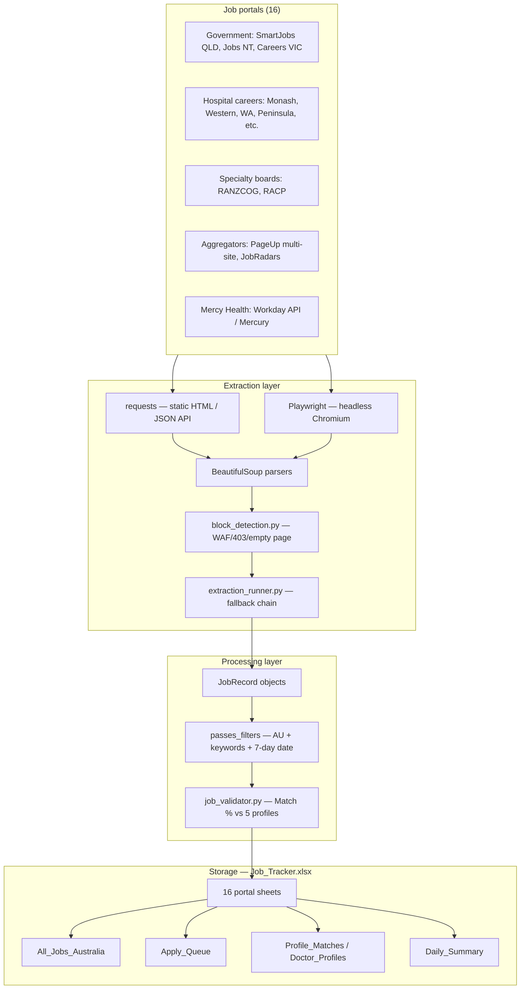

# Job Flow Analysis — Doctor Australia Job Collector

**Workbook analysed:** `Job_Tracker.xlsx`  
**Analysis date:** 3 July 2026  
**Codebase entry point:** `job_collector.py`  
**Current workbook state:** 16 portal tabs · 251 jobs · 21 sheets · 15 columns per job row

This document explains how medical jobs are fetched from each Australian portal, how they are processed, and how they land in `Job_Tracker.xlsx`.

---

## 1. Executive summary

The Doctor Australia Job Collector is a **Python batch pipeline** that runs daily (locally or via GitHub Actions). It:

1. Scrapes **16 job portals** (government, hospital, specialty board, and aggregator sites).
2. Normalises each listing into a `JobRecord` object.
3. Filters for **Australia-only**, **keyword-relevant**, and **recent** medical roles.
4. Scores each job against **5 doctor profiles** (demo CVs in `data/profiles.json`).
5. Writes results to **one Excel tab per portal**, then consolidates into summary sheets.

There is **no database**. `Job_Tracker.xlsx` (managed by `openpyxl`) is the single persistent store.

---

## 2. Key terminology

| Term | Simple explanation |
|------|-------------------|
| **Portal** | A job source website (e.g. SmartJobs QLD, Monash Health careers). Each portal maps to one Excel sheet. |
| **Scraper** | A Python function that fetches and parses jobs from one portal. |
| **JobRecord** | In-memory Python object (`job_utils.py`) holding title, hospital, link, specialty, etc., before Excel write. |
| **Static HTML scraping** | Download page HTML with `requests`, parse with BeautifulSoup — no browser. Fast, but fails on JavaScript-heavy sites. |
| **Playwright** | Headless Chromium browser automation — renders JavaScript, fills search forms, waits for results. |
| **Mercury** | ASP.NET careers platform used by Mercy Health (`mercury.com.au`). |
| **Workday API** | JSON POST endpoint (`/wday/cxs/{tenant}/{site}/jobs`) used as a structured job feed. |
| **PageUp** | ATS (Applicant Tracking System) used by NSW, QLD, and SA Health career sites. |
| **Fallback chain** | If the primary extraction method returns 0 jobs, `extraction_runner.py` tries alternate methods automatically. |
| **WAF / Cloudflare block** | Website firewall that returns 403 or a CAPTCHA page to bots/datacenter IPs. |
| **Dedup key** | `hospital + title` (normalised, lowercased) — used to avoid duplicate rows within a portal sheet. |
| **Match %** | 0–100 score comparing a job to the best-matching doctor profile (title 40%, specialty 25%, location 20%, experience 15%). |
| **Apply Queue** | Top 20 unapplied jobs across all portals, sorted by Match %. |
| **Daily_Summary** | Audit log of each portal run: method used, new jobs, errors, duration. |

---

## 3. Technologies and libraries

| Layer | Technology | Role |
|-------|-----------|------|
| Language | Python 3.11 | Entire pipeline |
| HTTP | `requests` | Static page downloads, Workday API POST |
| Browser automation | `playwright` (Chromium) | JS-rendered portals, form submission, stealth mode |
| HTML parsing | `beautifulsoup4` + `lxml` | DOM traversal, link/title extraction |
| Excel I/O | `openpyxl` | Read/write `Job_Tracker.xlsx` |
| User-Agent rotation | `fake-useragent` | Reduces simple bot detection |
| Retry logic | `tenacity` (available) + manual retries | Portal-level zero-job retry |
| PDF/CV parsing | `pypdf` | Load demo resumes from `data/Demo_Medical_Resumes.pdf` |
| Scheduling | GitHub Actions cron | Daily run at 8:00 AM AEST |
| Config | `config.py` | URLs, keywords, column definitions, portal toggles |

---

## 4. Step-by-step workflow

```
┌─────────────────────────────────────────────────────────────────────────┐
│  TRIGGER: python job_collector.py  OR  GitHub Actions (daily cron)      │
└─────────────────────────────────────────────────────────────────────────┘
                                    │
                                    ▼
┌─────────────────────────────────────────────────────────────────────────┐
│  1. INITIALISE                                                          │
│     • Load Job_Tracker.xlsx (ExcelManager)                              │
│     • Migrate sheets/columns if config changed                          │
│     • Build in-memory dedup index per portal sheet                      │
│     • Reset auto-disabled portals (portal_health.py)                    │
│     • Load 5 doctor profiles from data/profiles.json                    │
└─────────────────────────────────────────────────────────────────────────┘
                                    │
                                    ▼
┌─────────────────────────────────────────────────────────────────────────┐
│  2. SCRAPE ALL 16 PORTALS (sequential, isolated failures)               │
│     For each portal in ALL_SCRAPERS:                                    │
│       a. Skip if disabled in PLATFORMS_TO_RUN or auto-disabled          │
│       b. extract_jobs_multi_method() — primary + fallback chain         │
│       c. passes_filters() — keywords, Australia, date, valid URL        │
│       d. apply_validation_to_job() — profile scoring                    │
│       e. record_portal_run() — update portal_health.json                │
└─────────────────────────────────────────────────────────────────────────┘
                                    │
                                    ▼
┌─────────────────────────────────────────────────────────────────────────┐
│  3. WRITE TO EXCEL                                                      │
│     • excel.add_jobs(sheet, jobs) — per portal tab                      │
│     • excel.append_summary() — Daily_Summary row per portal             │
│     • excel.update_sheet_statuses() — "Yet to apply", "N days old"      │
│     • excel.revalidate_all_jobs() — refresh Match % / Best Profile      │
└─────────────────────────────────────────────────────────────────────────┘
                                    │
                                    ▼
┌─────────────────────────────────────────────────────────────────────────┐
│  4. POST-PROCESS (phase2_processor.py)                                  │
│     • Rebuild All_Jobs_Australia (concat all portal tabs)               │
│     • Rebuild Profile_Matches (per-profile scores side-by-side)         │
│     • Rebuild Apply_Queue (top 20 by Match %)                           │
│     • Write logs/daily_digest.md                                        │
└─────────────────────────────────────────────────────────────────────────┘
                                    │
                                    ▼
┌─────────────────────────────────────────────────────────────────────────┐
│  5. SAVE & LOG                                                          │
│     • excel.save() — auto column widths                                 │
│     • Run log → logs/run_YYYYMMDD_HHMMSS.log                            │
│     • GitHub Actions commits Job_Tracker.xlsx + logs/ to repo            │
└─────────────────────────────────────────────────────────────────────────┘
```

---

## 5. Complete data flow



### Field mapping: portal → Excel row

| Stage | Fields produced |
|-------|----------------|
| **Parser** | Job Title, Specialty, Experience Level, Hospital, Location, State, Salary (rare), Posted Date, Apply Link |
| **ExcelManager.add_jobs** | + Job Added On, Portal (sheet name), Best Profile, Match %, Status (`Yet to apply`), Applied? (blank) |
| **update_sheet_statuses** | Status updated to `N days old` or `Applied` |
| **User (manual)** | Applied? = Y/N |

---

## 6. Per-portal extraction reference

Current job counts from `Job_Tracker.xlsx` (July 2026 run):

| Excel sheet | Portal key | Jobs | Primary method | Technology | Parser |
|-------------|-----------|------|----------------|------------|--------|
| SmartJobs_QLD | `smartjobs_qld` | 42 | Playwright form search | Playwright + stealth | `parse_smartjobs_results` |
| Jobs_NT | `jobs_nt` | 39 | Playwright form search | Playwright | `parse_jobs_nt` |
| Careers_VIC | `careers_vic` | 3 | Playwright | Playwright | Generic `parse_job_cards` |
| Monash_Health | `monash_health` | 24 | Playwright | Playwright | Generic `parse_job_cards` |
| Western_Health | `western_health` | 18 | Static HTML | requests | Generic `parse_job_cards` |
| WA_Health | `wa_health` | 25 | Playwright | Playwright | Generic `parse_job_cards` |
| Mercy_Workday | `mercy_workday` | 15 | Workday API → Mercury → Playwright | JSON API + requests + Playwright | API JSON / Mercury HTML / Workday HTML |
| Peninsula_Health | `peninsula_health` | 9 | Playwright | Playwright (12s wait) | `parse_peninsula_health` |
| The_Womens | `the_womens` | 1 | Static HTML | requests | Generic `parse_job_cards` |
| Grampians_Health | `grampians_health` | 15 | Static HTML | requests | Generic `parse_job_cards` |
| Eastern_Health | `eastern_health` | 12 | Static HTML | requests | Generic `parse_job_cards` |
| RCH | `rch` | 8 | Static HTML | requests | Generic `parse_job_cards` |
| RANZCOG | `ranzcog` | 3 | Playwright stealth | Playwright + RSS + Peninsula fallback | `parse_ranzcog` / RSS / O&G board |
| RACP | `racp` | 24 | Static HTML | requests | Custom table/link parser |
| JobRadars | `jobradars` | 4 | Playwright stealth | Playwright → NSW Health fallback | Generic / `parse_nsw_health` |
| PageUp | `pageup` | 9 | Multi-site static + Playwright | requests + Playwright | NSW / QLD / SA custom parsers |

---

## 7. Portal-by-portal detail

### 7.1 Government portals

#### SmartJobs QLD (`SmartJobs_QLD`)
- **URL:** `smartjobs.qld.gov.au` — Queensland Health organ search (`in_organid=14904`)
- **Method:** Playwright opens the Oracle/Taleo-style search form, types each keyword (`registrar`, `medical officer`, `doctor`), presses Enter, waits 10s
- **Parsing:** Links matching `viewFullSingle` or `/jobs/QLD-\d` → `parse_smartjobs_results`
- **Search:** 3 keyword searches merged via `merge_jobs()` (dedup by apply link)
- **Pagination:** Not implemented — first results page per keyword only (capped at 50 total)
- **Fallback:** Static HTML (usually blocked by WAF)

#### Jobs NT (`Jobs_NT`)
- **URL:** `jobs.nt.gov.au/Home/Search`
- **Method:** Playwright fills keyword input, clicks Search, waits 10s
- **Parsing:** Accordion `.jobTitle` panels → constructs `Home/JobDetails/{RTF_ID}` links
- **Search:** 4 keywords: `medical`, `doctor`, `registrar`, `health`
- **Pagination:** None — first page per keyword (cap 50)

#### Careers VIC (`Careers_VIC`)
- **URL:** Pre-built search `?keywords=registrar+medical`
- **Method:** Playwright render
- **Parsing:** Generic card parser (`.job-result`, `article`)

---

### 7.2 Hospital career pages

Most Victorian hospital sites use **PageUp-style** career URLs (`/search/?q=...`).

| Portal | Config method | Fetch | Notes |
|--------|--------------|-------|-------|
| Monash Health | `playwright` | JS render required | 24 jobs |
| Western Health | `static` | requests | Works without browser |
| WA Health | `playwright` | JS render | medcareerswa.health.wa.gov.au |
| Peninsula Health | `playwright` | 12s wait + custom parser | Retries once on 0 jobs |
| The Women's | `static` | requests | Often 1 job; site uses SuccessFactors redirect |
| Grampians / Eastern / RCH | `static` | requests | Standard card parser |

**Generic parser flow (`parse_job_cards`):**
1. Find elements matching CSS selectors (`.job-result`, `article`, etc.)
2. Extract `<a href>` links matching job URL patterns
3. Filter by `config.KEYWORDS` in title or card text
4. Build `JobRecord` via `build_job()` — auto-detects specialty, experience level, state
5. Cap at **50 jobs** per portal per run

---

### 7.3 Mercy Health (`Mercy_Workday`)

Despite the sheet name, Mercy uses a **three-tier chain**:

```
1. Workday CXS API  (POST JSON → mercyagedcare.wd105.myworkdayjobs.com)
        ↓ if empty
2. Mercury ASP.NET  (GET SearchResults.aspx?Keywords=...)
        ↓ if empty
3. Workday Playwright  (search box automation)
```

- **API:** `fetch_json_post` with keywords; parses `jobPostings[]` array
- **Mercury:** Parses vacancy links from ASP.NET HTML; 60s timeout, 2 retries per keyword
- **Dedup:** By `apply_link` within each sub-method

---

### 7.4 Specialty boards

#### RANZCOG (`RANZCOG`)
```
Playwright stealth → parse_ranzcog
        ↓ if blocked/empty
Static HTML attempt
        ↓ if empty
RSS feed parse (ranzcog.edu.au/rss)
        ↓ if empty
Peninsula Health O&G board fallback (board 403)
```
- Often blocked from datacenter IPs; fallbacks supply O&G registrar listings

#### RACP (`RACP`)
- **Static only** — parses `racp.edu.au/about/all-medical-positions-vacant`
- Scans tables, articles, list items for AU medical position links
- Filters non-AU locations explicitly
- Dedup by `apply_link`

---

### 7.5 Aggregators

#### PageUp multi-site (`PageUp`)
Fetches **three separate health department sites** in one scraper:

| Site | URL | Method | Parser |
|------|-----|--------|--------|
| NSW Health | `jobs.health.nsw.gov.au` | static | `parse_nsw_health` |
| QLD Health | `careers.health.qld.gov.au` | playwright | `parse_qld_health` |
| SA Health | `careers.sahealth.sa.gov.au` | static | `parse_pageup_sa` |

Jobs merged with dedup by `apply_link` or `title` across sites.

#### JobRadars (`JobRadars`)
- **Primary:** Playwright stealth on `australia.jobradars.com` (often Cloudflare 403 from GitHub Actions)
- **CI behaviour:** Skipped in CI when `JOBRADARS_SKIP_IN_CI=True` → triggers NSW Health fallback
- **Fallback:** `scrape_jobradars_nsw_fallback()` — reuses NSW Health parser, tags platform as JobRadars

---

## 8. Search and pagination handling

| Pattern | Portals using it | Implementation |
|---------|-----------------|----------------|
| **Pre-built search URL** | Western Health, Grampians, Eastern, RCH, Careers VIC, WA Health | Single GET/Playwright to `search_url` in config |
| **Multi-keyword loop** | SmartJobs QLD, Jobs NT, Mercy (API/Mercury) | Loop keywords; merge + dedup |
| **Playwright form fill** | SmartJobs QLD, Jobs NT | Locate input → fill → submit → wait |
| **Multi-site aggregation** | PageUp | Loop `PAGEUP_AU_SEARCH_URLS` entries |
| **Pagination** | *None currently* | All parsers cap at **50 jobs** from first page/results only |

**Polite delays:** 2–5 second random pause between HTTP requests (`config.REQUEST_DELAY_MIN/MAX`).

**Date filter:** Jobs with `posted_date` older than **7 days** (`DATE_FILTER_DAYS`) are dropped unless date is unknown (then kept).

---

## 9. Data extraction process

### 9.1 HTML → JobRecord

```
Raw HTML
  → BeautifulSoup (lxml)
  → Portal-specific or generic parser
  → build_job() / JobRecord constructor
  → detect_specialty()     — keyword rules from SPECIALTY_RULES
  → detect_experience_level() — PHO, Registrar, Consultant, etc.
  → detect_state()         — NSW, VIC, QLD, etc.
  → parse_relative_posted() — "3 days ago" → datetime
```

### 9.2 Filtering (`passes_filters`)

A job must pass **all** of:
1. Title length ≥ 3
2. Contains at least one `config.KEYWORDS` term
3. `passes_australia_filter` — AU location/link; rejects explicit non-AU places
4. `is_within_date_filter` — posted within 7 days (or date unknown)
5. Valid `http` apply link if present

### 9.3 Profile matching (`job_validator.py`)

After filtering, each job is scored against 5 profiles:

| Component | Weight | What it checks |
|-----------|--------|----------------|
| Title relevance | 40% | Fuzzy match of job title to profile specialty/level |
| Specialty | 25% | Detected specialty vs profile specialty |
| Location | 20% | Job state vs `preferred_states` in profile |
| Experience | 15% | Job level vs profile level |

Best profile name and Match % are written to Excel. Jobs below 30% confidence get validation flags internally (not written to Excel after recent column removal).

### 9.4 Block detection (`block_detection.py`)

Before trusting empty results, HTML is analysed for:
- 403 / Cloudflare / CAPTCHA patterns → `is_blocked`
- 404 / error pages → `is_error_page`
- "No results" text → `is_no_results`

This prevents silent failures from being treated as "genuinely no jobs".

---

## 10. Duplicate removal (four layers)

| Layer | Where | Key | Scope |
|-------|-------|-----|-------|
| **1. Parser seen-set** | Each scraper/parser | `apply_link` | Within one fetch |
| **2. merge_jobs()** | SmartJobs, Jobs NT | `apply_link` or `title` | Across keyword searches |
| **3. PageUp aggregator** | `scrape_pageup` | `apply_link` or `title` | Across NSW/QLD/SA sites |
| **4. Excel index** | `ExcelManager.add_jobs` | `dedup_key(hospital, title)` | Across runs on same portal sheet |

**Cross-portal duplicates are NOT removed.** The same role may appear on both `PageUp` and `Eastern_Health` — `All_Jobs_Australia` currently lists all portal rows (251 rows from 16 tabs).

**On duplicate within a portal:** Existing row is **updated** (Apply Link, Best Profile, Match %) — not re-inserted. `Job Added On` is preserved.

---

## 11. Data storage

### 11.1 Primary store: `Job_Tracker.xlsx`

| Sheet | Purpose | Rows (current) |
|-------|---------|----------------|
| 16 portal tabs | One row per job per source | 251 total |
| `All_Jobs_Australia` | Consolidated copy of all portal rows | 251 |
| `Apply_Queue` | Top 20 jobs to apply for (by Match %) | 20 |
| `Profile_Matches` | Each job × match % for all 5 profiles | 251 |
| `Doctor_Profiles` | Profile metadata from `profiles.json` | 5 |
| `Daily_Summary` | Per-portal run audit trail | 176 |

### 11.2 Column schema (portal tabs)

```
Job Title | Specialty | Experience Level | Hospital | Location | State |
Salary | Posted Date | Job Added On | Apply Link | Portal | Best Profile |
Match % | Status | Applied?
```

### 11.3 Secondary logs (JSON / Markdown)

| File | Contents |
|------|----------|
| `logs/extraction_stats.json` | Per-portal method attempts, success rates |
| `logs/portal_health.json` | Zero-job streaks, auto-disabled portals |
| `logs/daily_digest.md` | Human-readable run summary |
| `logs/run_*.log` | Full text log per execution |

### 11.4 Automation persistence

GitHub Actions (`.github/workflows/job_collector.yml`):
- Runs daily at 8:00 AM AEST
- Commits updated `Job_Tracker.xlsx` and `logs/` back to the repository

---

## 12. Extraction method comparison

### 12.1 Method types used

| Method | Speed | Reliability | JS support | Bot risk | Portals |
|--------|-------|-------------|------------|----------|---------|
| **Static HTML** (`requests`) | Fast | High on simple sites | No | Low | Western, Grampians, Eastern, RCH, RACP, NSW PageUp, SA PageUp |
| **Playwright** | Slow (5–15s) | High on SPAs | Yes | Medium | SmartJobs, Jobs NT, Monash, WA, Peninsula, Careers VIC, QLD PageUp |
| **Playwright stealth** | Slowest | Needed for WAF sites | Yes | Lower | RANZCOG, JobRadars |
| **Workday JSON API** | Fast | High when tenant correct | N/A | Low | Mercy Health |
| **Mercury HTML** | Medium | Variable (timeouts) | Partial | Medium | Mercy Health |
| **RSS/XML** | Fast | Fallback only | N/A | Low | RANZCOG |
| **Cross-portal fallback** | Medium | Indirect data | Varies | Low | RANZCOG→Peninsula, JobRadars→NSW |

### 12.2 Fallback chain (`extraction_runner.py`)

| Config method | Primary | Automatic fallback |
|---------------|---------|-------------------|
| `static` | requests + BeautifulSoup | Playwright |
| `playwright` | Playwright | Static HTML |
| `mercury` | Mercury HTML | Workday API |
| `pageup` | Multi-site PageUp scraper | Playwright on PageUp URLs |

Additionally, **zero-job retry**: primary method is attempted twice if the first returns 0 jobs (`PORTAL_ZERO_RETRY_ON_ZERO`).

### 12.3 Portal health auto-disable

If a portal returns **0 jobs for 3 consecutive runs**, it is auto-disabled (`portal_health.py`) until the next run's `reset_disabled_portals()` call at startup.

---

## 13. Suggested improvements

### 13.1 High priority

| Improvement | Why | Effort |
|-------------|-----|--------|
| **Add pagination** | SmartJobs (42) and Jobs NT (39) likely have more jobs on page 2+ | Medium |
| **Fetch job detail pages** | Descriptions improve Match %; salary/closing date often only on detail page | Medium |
| **Cross-portal dedup** | Same NSW role may appear in PageUp and JobRadars fallback | Medium |
| **Closing date column** | Critical for prioritising applications | Medium |
| **CI smoke tests** | Prevent regression to empty portal tabs | Low |

### 13.2 Reliability

| Improvement | Why |
|-------------|-----|
| **Direct RANZCOG / JobRadars scrapers** | Replace Peninsula/NSW fallbacks with authoritative source |
| **Residential proxy for CI** | GitHub Actions datacenter IPs trigger Cloudflare blocks |
| **Correct Mercy Workday tenant** | Current API uses `mercyagedcare` (aged care), not acute Mercy Health |
| **The Women's SuccessFactors URL** | Site migrated; static scraper only finds 1 job |

### 13.3 Data quality

| Improvement | Why |
|-------------|-----|
| **Populate Salary** | Column exists but 0% filled |
| **Suburb-level Location** | Many rows show state twice (`VIC` / `VIC`) |
| **Stable Job ID** | PageUp `/caw/en/job/{id}` and SmartJobs `jnCounter` are better dedup keys than title |
| **Last Scraped On** | Separate from `Job Added On` to track stale listings |

### 13.4 User experience

| Improvement | Why |
|-------------|-----|
| **Email/Telegram alerts** | `daily_digest.md` exists but requires manual checking |
| **Excel Index sheet** | Explain 21 tabs and column meanings on-sheet |
| **Conditional formatting** | Match % colour bands for quick scanning |
| **Application tracking** | Interview date, outcome beyond `Applied?` |

### 13.5 Architecture (longer term)

| Improvement | Why |
|-------------|-----|
| **SQLite + Excel export** | Better querying at scale; Excel becomes a view |
| **Parallel portal scraping** | 16 sequential portals × 5–15s each = slow total run time |
| **Structured scraper tests** | `scripts/test_failing_portals.py` should run in CI on every push |

---

## 14. Quick reference — file map

| File | Role in job flow |
|------|-----------------|
| `job_collector.py` | Main orchestrator |
| `config.py` | Portal URLs, methods, keywords, columns |
| `extraction_runner.py` | Multi-method fallback chain |
| `scrapers/govt_portals.py` | SmartJobs, Jobs NT, Careers VIC |
| `scrapers/hospital_careers.py` | 8 hospital career scrapers |
| `scrapers/specialty_boards.py` | RANZCOG, RACP |
| `scrapers/aggregators.py` | PageUp, JobRadars |
| `scrapers/workday_scraper.py` | Mercy Health |
| `scrapers/base.py` | HTTP, Playwright, generic parser |
| `scrapers/portal_parsers.py` | Site-specific HTML parsers |
| `scrapers/block_detection.py` | WAF/empty page detection |
| `job_utils.py` | JobRecord, filters, dedup key |
| `job_validator.py` | Profile Match % scoring |
| `excel_manager.py` | Excel read/write, dedup index |
| `phase2_processor.py` | Consolidation, queue, digest |
| `portal_health.py` | Auto-disable failing portals |

---

*Generated from codebase analysis and `Job_Tracker.xlsx` snapshot (3 July 2026).*
